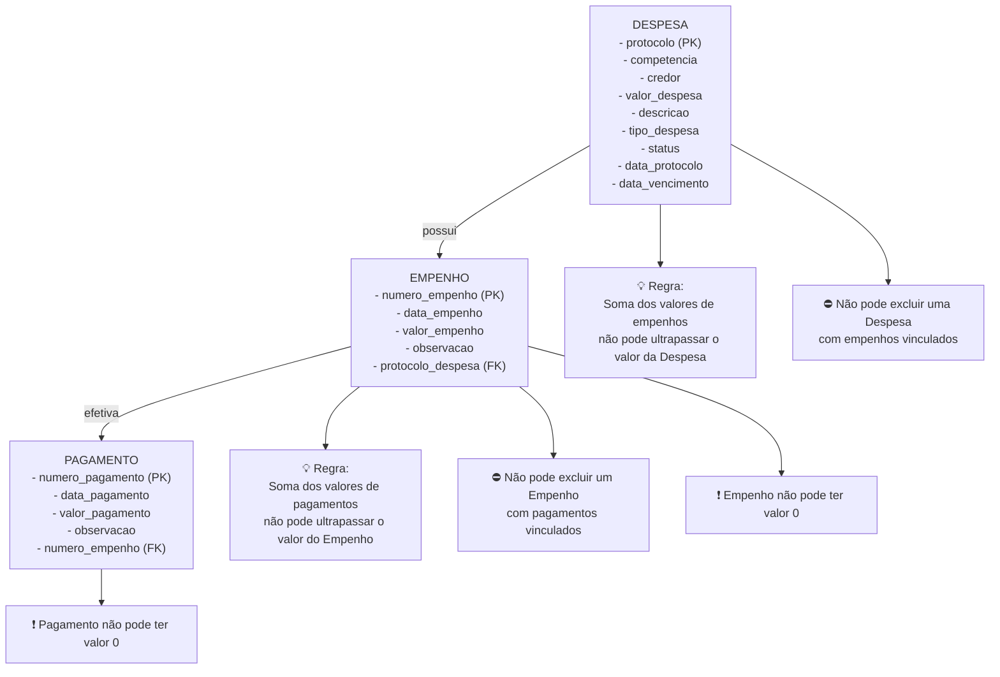

```mermaid
flowchart TB
    %% TABELAS
    DESPESA["DESPESA\n- protocolo (PK)\n- competencia\n- credor\n- valor_despesa\n- descricao\n- tipo_despesa\n- status\n- data_protocolo\n- data_vencimento"]

    EMPENHO["EMPENHO\n- numero_empenho (PK)\n- data_empenho\n- valor_empenho\n- observacao\n- protocolo_despesa (FK)"]

    PAGAMENTO["PAGAMENTO\n- numero_pagamento (PK)\n- data_pagamento\n- valor_pagamento\n- observacao\n- numero_empenho (FK)"]

    %% RELAÇÕES
    DESPESA -->|possui| EMPENHO
    EMPENHO -->|efetiva| PAGAMENTO

    %% REGRAS DE NEGÓCIO
    RULE1["💡 Regra:\nSoma dos valores de empenhos\nnão pode ultrapassar o valor da Despesa"]
    RULE2["💡 Regra:\nSoma dos valores de pagamentos\nnão pode ultrapassar o valor do Empenho"]
    RULE3["⛔ Não pode excluir uma Despesa\ncom empenhos vinculados"]
    RULE4["⛔ Não pode excluir um Empenho\ncom pagamentos vinculados"]
    RULE5["❗ Empenho não pode ter valor 0"]
    RULE6["❗ Pagamento não pode ter valor 0"]

    %% CONEXÕES COM AS REGRAS
    DESPESA --> RULE1
    EMPENHO --> RULE2
    DESPESA --> RULE3
    EMPENHO --> RULE4
    EMPENHO --> RULE5
    PAGAMENTO --> RULE6
```
