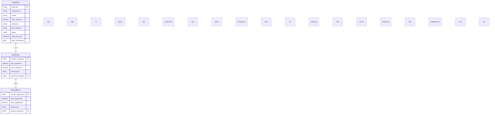

# Diagrama ER da Aplicacao

```mermaid

erDiagram

  DESPESA {
    string protocolo PK
    string competencia
    string credor
    decimal valor_despesa
    string descricao
    string tipo_despesa
    string status
    datetime data_protocolo
    date data_vencimento
  }

  EMPENHO {
    UUID numero_empenho PK
    datetime data_empenho
    decimal valor_empenho
    string observacao
    string protocolo_despesa FK
  }

  PAGAMENTO {
    UUID numero_pagamento PK
    datetime data_pagamento
    decimal valor_pagamento
    string observacao
    UUID numero_empenho FK
  }

  DESPESA ||--o{ EMPENHO : possui
  EMPENHO ||--o{ PAGAMENTO : efetiva

  note right of EMPENHO
    Soma dos empenhos nao pode
    ultrapassar valor da despesa
    Nao excluir empenho com pagamentos
  end

  note right of PAGAMENTO
    Soma dos pagamentos nao pode
    ultrapassar valor do empenho
  end

  note right of DESPESA
    Nao excluir despesa com empenhos
  end
```
